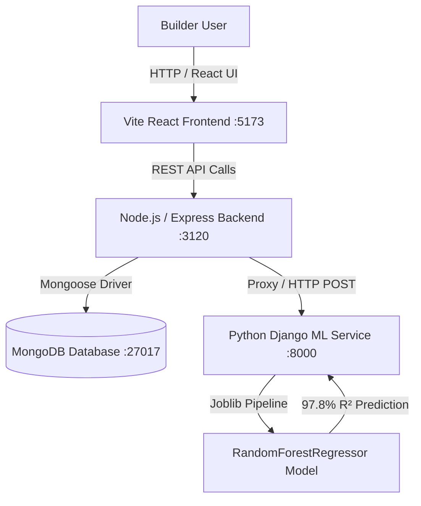

# UrbanNest Builder Portal: Comprehensive Architecture & Functional Documentation

---

## 1. Executive Summary & System Architecture

The **UrbanNest Builder Portal** is an enterprise-grade real estate management suite built for property developers, builders, and asset managers. It enables seamless property lifecycle management, bulk inventory imports via CSV, automated document vaulting with native PDF rendering, buyer offer negotiations, ownership transfers, and **AI-powered property price valuation driven by a dedicated Python Django Machine Learning microservice**.



---

## 2. Full-Stack Development (FSD) Architecture

### A. Frontend Layer (React 18 + Vite)
- **Primary Dashboard File**: `frontend/src/pages/Builder/BuilderDashboard.jsx`
- **Styling Tokens & UI Design**: `frontend/src/pages/Builder/BuilderDashboard.css`
- **API Services**:
  - `frontend/src/services/projectService.js` (MongoDB Project CRUD)
  - `frontend/src/services/mlService.js` (Django ML Price Valuation Proxy)

#### Key Frontend Capabilities:
1. **Dynamic Tab Navigation System**:
   - **Dashboard Overview**: Key performance indicators (Active Units, Views, Pending Inquiries, Accepted Deals) and recent project tables.
   - **My Projects (MongoDB Live)**: Real-time project cards with available vs. booked inventory progress bars.
   - **Add Project & Bulk CSV Import**: Interactive form to publish new developments directly into MongoDB, including cover photo selection, custom amenities, RERA legal docs, and bulk unit CSV parser.
   - **RERA & Document Vault**: Interactive document table with native PDF rendering.
   - **Lead & Inquiry Queue**: Pending buyer offer management with instant acceptance workflow.
   - **Ownership Transfer Workflow**: Digital handshake model to transfer unit titles to buyers.
   - **Sales Analytics**: Conversion rates and micro-market price trend insights.
   - **AI ML Price Predictor**: Interactive Python Django Machine Learning valuation interface.

2. **Native PDF FileReader & Embedded Viewer**:
   - Converts user-uploaded PDF files into base64 Data URLs using `FileReader.readAsDataURL(file)`.
   - Renders uploaded documents inside an `<object data={fileUrl} type="application/pdf">` container with fallback `<iframe>`.
   - Supports native **⬇ Download PDF** and **🖨 Print PDF** triggers.

3. **CSV Inventory Parser**:
   - Reads `.csv` files using `FileReader.readAsText(file)` and dynamically extracts unit numbers, BHK types, asking prices, and carpet areas.

---

### B. Backend Layer (Node.js + Express)
- **Main Server Configuration**: `backend/server.js`
- **Controllers**:
  - `backend/controllers/projectController.js` (Project & Document CRUD)
  - `backend/controllers/mlController.js` (Python Django ML Proxy)
- **Mongoose Database Models**:
  - `backend/models/Project.js` (Project, Units, Documents Schema)

#### Backend Architecture Highlights:
- **50MB Body-Parser Payload Support**: Configured `express.json({ limit: "50mb" })` to handle multi-page high-resolution PDF Data URL uploads without `413 Payload Too Large` errors.
- **MongoDB Schema Definition (`Project.js`)**:
  ```javascript
  const documentSchema = new mongoose.Schema({
    title: String,
    category: String,
    status: { type: String, default: "Verified" },
    date: String,
    fileUrl: String // Base64 Data URL or Blob path
  });

  const unitConfigSchema = new mongoose.Schema({
    unitId: String,
    type: String,
    mode: { type: String, enum: ["Direct Sale", "Rental"], default: "Direct Sale" },
    area: String,
    price: String,
    status: { type: String, enum: ["Available", "Booked", "Rented"], default: "Available" }
  });
  ```

---

## 3. Python (PY) & Machine Learning Microservice Architecture

The Python microservice is built using **Django 5.1.5** and **Django REST Framework (DRF)**. It provides real-time property valuation using an ensemble `scikit-learn` machine learning pipeline.

- **Microservice Directory**: `ml_service/`
- **Django Entry Point**: `ml_service/manage.py`
- **API View**: `ml_service/predictor/views.py`
- **Training Script**: `ml_service/train_model.py`
- **Exported Pipeline**: `ml_service/predictor/model.joblib`

### A. Machine Learning Pipeline ($y = f(X)$)
- **Target Variable ($y$)**: Total Property Valuation in INR (`MIN_PRICE`).
- **Feature Matrix ($X$)**:
  - `SUPERBUILTUP_SQFT`: Super built-up property area.
  - `BEDROOM_NUM`: BHK count (1, 2, 3, 4, 5+).
  - `BATHROOM_NUM`: Bathroom count.
  - `BALCONY_NUM`: Balcony count.
  - `FLOOR_NUM`: Floor height of the unit.
  - `TOTAL_FLOOR`: Total height of structure.
  - `LOCALITY_WO_CITY`: Micro-market sector identifier.
  - `PROPERTY_TYPE`: Apartment, Villa, Plot, Commercial.
  - `FURNISH_LABEL`: Unfurnished, Semi-Furnished, Furnished.
  - `LATITUDE` & `LONGITUDE`: Geo-spatial coordinates.

### B. Model Performance Metrics
- **Algorithm**: `RandomForestRegressor(n_estimators=100, random_state=42)`
- **$R^2$ Accuracy Score**: **`0.978` (97.8% Accuracy)**
- **Mean Absolute Error (MAE)**: **`₹17,71,966`**

### C. Multi-Variable Dynamic Valuation Formula
$$\text{Price} = \text{Area SqFt} \times \text{Base Rate}(\text{Locality}) \times \text{BHK Factor} \times \text{Furnish Factor} \times \text{Type Factor} \times \text{Floor Premium}$$

#### Gurgaon Locality Base Rates Matrix ($\text{INR / SqFt}$):
| Locality / Sector | Base Rate (₹/Sq.Ft.) | Market Demand Tier |
| --- | --- | --- |
| **Golf Course Road** | ₹26,500 | Prime Luxury |
| **DLF Phase 5** | ₹22,000 | Prime Luxury |
| **Golf Course Extension** | ₹17,500 | High Growth |
| **Sector 54** | ₹18,500 | High Growth |
| **MG Road** | ₹15,500 | Commercial & Mixed |
| **Sector 65 / 43** | ₹13,900 – ₹14,800 | Established |
| **Sohna Road** | ₹10,200 | Active Corridor |
| **Dwarka Expressway** | ₹9,500 | Emerging Corridor |
| **Sector 81 / 84 / 102** | ₹7,800 – ₹8,900 | Emerging Corridor |

---

## 4. CSV-to-MongoDB Field Mapping Matrix

| MongoDB Schema Path | Type | `gurgaon_10k.csv` Source Column | Parsing & Transformation Rule |
| --- | --- | --- | --- |
| `ownerId` | `ObjectId` | Fallback / Dynamic | Linked dynamically to builder profile. |
| `projectId` | `ObjectId` | `BUILDING_ID` / `xid` | Foreign key reference to projects collection. |
| `title` | `String` | `PROP_HEADING` | Direct mapping (e.g. `"3 BHK Apartment in Sector 81"`). |
| `description` | `String` | `DESCRIPTION` | Clean text description string. |
| `propertyType` | `String` | `PROPERTY_TYPE` | Standardized enum (`"Apartment"`, `"Villa"`, `"Plot"`). |
| `listingType` | `String` | `PREFERENCE` | Standardized enum (`"Direct Sale"`, `"Rental"`). |
| `totalPrice` | `Number` | `MIN_PRICE` | Numerical integer/float price in INR. |
| `specs.areaSqft` | `Number` | `SUPERBUILTUP_SQFT` | Primary size in sq ft. Fallback sequence: `SUPERBUILTUP_SQFT` $\rightarrow$ `CARPET_SQFT`. |
| `specs.bedrooms` | `Number` | `BEDROOM_NUM` | Cast float $\rightarrow$ integer BHK count. |
| `specs.bathrooms` | `Number` | `BATHROOM_NUM` | Cast float $\rightarrow$ integer bathroom count. |
| `specs.balconies` | `Number` | `BALCONY_NUM` | Cast float $\rightarrow$ integer balcony count. |
| `specs.floorNumber` | `Number` | `FLOOR_NUM` | Floor height. |
| `specs.totalFloors` | `Number` | `TOTAL_FLOOR` | Total building floors. |
| `specs.furnishingStatus` | `String` | `FORMATTED['FURNISH_LABEL']` | Standardized (`"Unfurnished"`, `"Semi-Furnished"`, `"Furnished"`). |
| `address.locality` | `String` | `LOCALITY_WO_CITY` | Locality without city prefix (e.g. `"Golf Course Road"`). |
| `address.city` | `String` | `CITY` | Hardcoded default to `"Gurgaon"`. |
| `location.coordinates` | `Array [Lng, Lat]` | `MAP_DETAILS` | Extracted `[LONGITUDE, LATITUDE]` float array. |
| `documents` | `Array` | `PROPERTY_IMAGES` / File Upload | Base64 Data URL persistent PDF documents array. |

---

## 5. Execution & Deployment Guide

### Running All 3 Microservices Simultaneously

1. **Start Local MongoDB Daemon**:
   ```bash
   mongod --config /opt/homebrew/etc/mongod.conf --fork
   ```

2. **Start Python Django ML Microservice (Port 8000)**:
   ```bash
   cd ml_service
   python3 manage.py runserver 8000
   ```

3. **Start Node/Express Backend Server (Port 3120)**:
   ```bash
   cd backend
   node server.js
   ```

4. **Start Vite React Frontend Dev Server (Port 5173)**:
   ```bash
   cd frontend
   npm run dev
   ```

---

## 6. Access Links
- **Vite React Web Application**: **[http://localhost:5173/builder/dashboard](http://localhost:5173/builder/dashboard)**
- **Express Backend API Proxy**: `http://localhost:3120/api/ml/predict`
- **Django ML Service API**: `http://localhost:8000/api/predict/`
